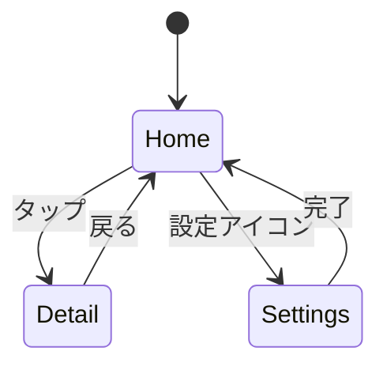

# Screen Flows Reference

画面フロー定義の参照ドキュメント索引。

## クイックリファレンス

| ドキュメント | 用途 | 主要コンテンツ |
|-------------|------|---------------|
| [flow-patterns.md](flow-patterns.md) | 遷移パターン | ナビゲーション種別、Mermaid記法 |
| [workflow.md](workflow.md) | 作業手順 | ステップバイステップのワークフロー |
| [section-template.md](section-template.md) | 出力テンプレート | spec.md セクション形式 |

## 遷移パターン索引

### ナビゲーション種別

| 種別 | 説明 | ユースケース |
|------|------|-------------|
| **push** | 画面スタックに追加 | 詳細画面への遷移 |
| **pop** | 前画面に戻る | 戻るボタン |
| **replace** | 現在画面を置換 | ログイン後のホーム遷移 |
| **modal** | オーバーレイ表示 | 確認ダイアログ、設定 |
| **tab** | タブ切り替え | ボトムナビゲーション |

### Mermaid記法

### トリガー種別

| トリガー | 例 |
|---------|-----|
| タップ/クリック | ボタン、リストアイテム |
| スワイプ | カルーセル、削除 |
| 長押し | コンテキストメニュー |
| システム | プッシュ通知、ディープリンク |

## 使用方法

1. 画面間の遷移を特定
2. flow-patterns.md で該当パターンを参照
3. Mermaid図を生成
4. section-template.md 形式で出力
