# 画面フローパターン集

一般的な画面遷移パターンを定義します。

## 目次

1. [ナビゲーション種別](#ナビゲーション種別)
2. [一覧・詳細パターン](#一覧詳細パターン)
3. [フォームフロー](#フォームフロー)
4. [認証フロー](#認証フロー)
5. [モーダルフロー](#モーダルフロー)
6. [タブ・ステップ](#タブステップ)
7. [エラーフロー](#エラーフロー)
8. [Mermaid記法](#mermaid記法)

---

## ナビゲーション種別

### 遷移タイプ

| タイプ | 説明 | アニメーション | 戻り方 |
|--------|------|---------------|--------|
| push | 新画面をスタックに追加 | 右からスライド | popで戻る |
| pop | スタックから画面を削除 | 左へスライド | - |
| replace | 現在の画面を置換 | フェード | 戻れない |
| modal | オーバーレイ表示 | 下からスライド/フェード | dismiss |
| reset | スタックをリセット | フェード | 戻れない |

### 使い分け

| シナリオ | タイプ |
|----------|--------|
| 一覧 → 詳細 | push |
| 詳細 → 一覧（戻る） | pop |
| ログイン成功 → ホーム | reset |
| ログアウト → ログイン | reset |
| フィルター表示 | modal |
| 確認ダイアログ | modal |
| タブ切り替え | replace（同一画面内） |

---

## 一覧・詳細パターン

### 基本パターン

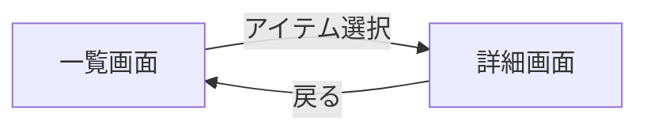

### パラメータ

| 遷移 | パラメータ | 型 | 説明 |
|------|-----------|-----|------|
| 一覧 → 詳細 | itemId | string | アイテム識別子 |
| 詳細 → 編集 | itemId | string | 編集対象ID |

### 派生パターン

#### 一覧 → 詳細 → 編集

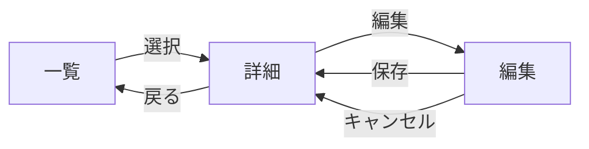

#### 一覧 → 詳細 → 関連詳細

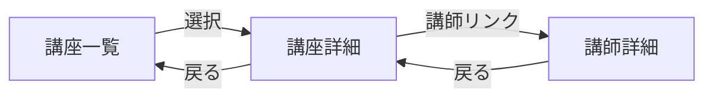

---

## フォームフロー

### 基本パターン（単一画面）

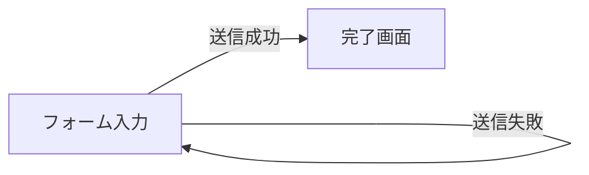

### 確認画面ありパターン

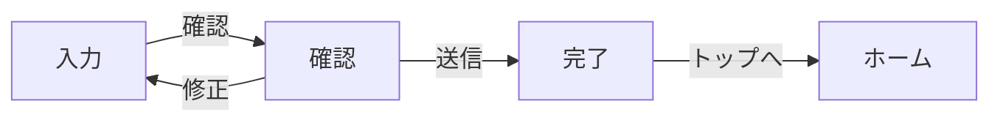

### パラメータ

| 遷移 | パラメータ | 説明 |
|------|-----------|------|
| 入力 → 確認 | formData | フォームデータ全体 |
| 確認 → 入力 | formData | 修正用データ |
| 確認 → 完了 | resultId | 登録結果ID |

### ステップフォーム

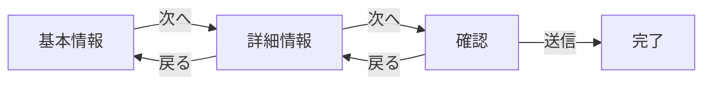

### 条件分岐フォーム

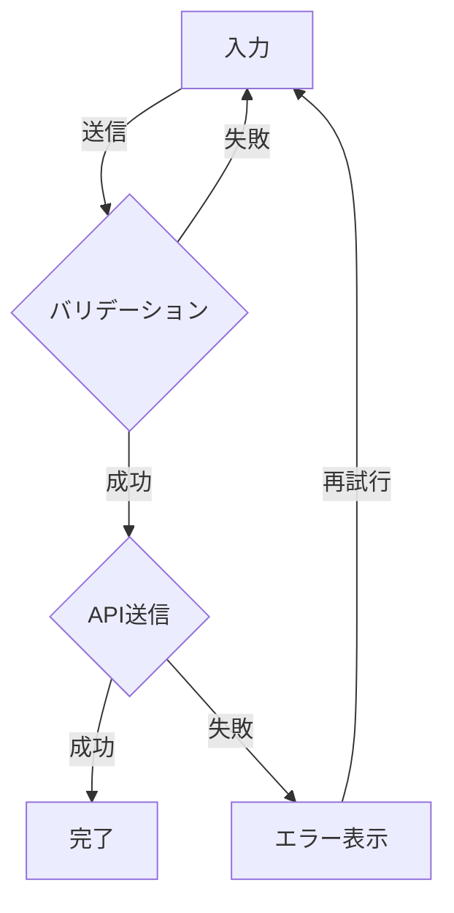

---

## 認証フロー

### ログインフロー

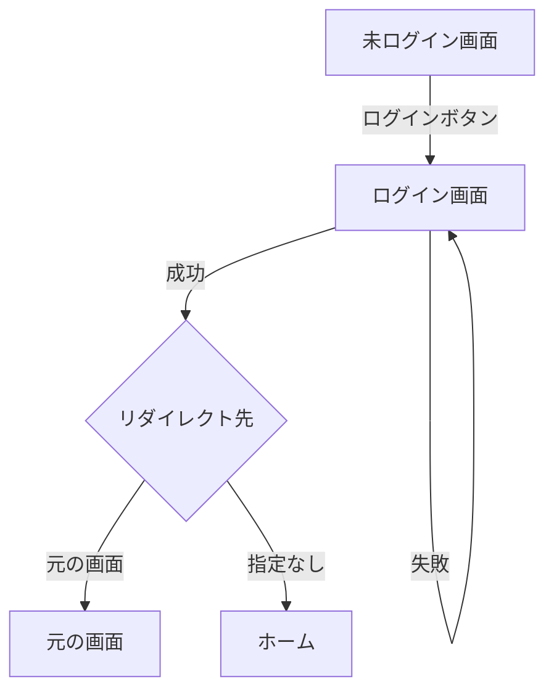

### パラメータ

| 遷移 | パラメータ | 説明 |
|------|-----------|------|
| 任意 → ログイン | redirectTo | ログイン後の遷移先 |
| ログイン → 元の画面 | - | redirectToを使用 |

### 会員登録フロー

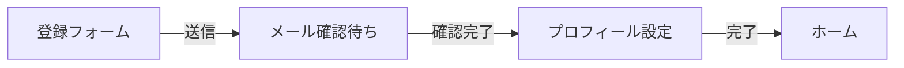

### ログアウトフロー

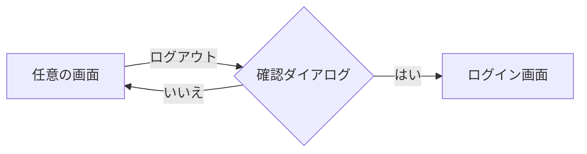

### 認証チェック

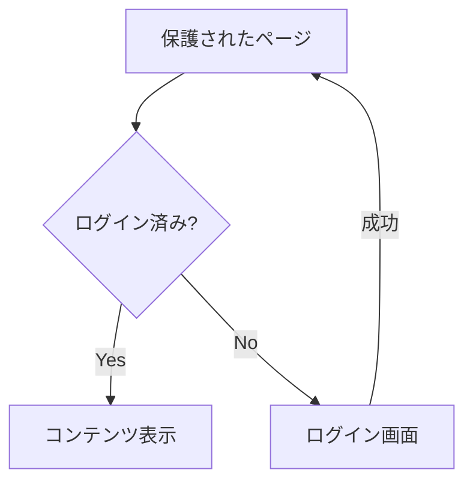

---

## モーダルフロー

### 基本パターン

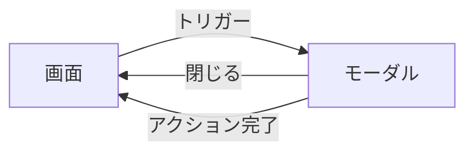

### 確認ダイアログ

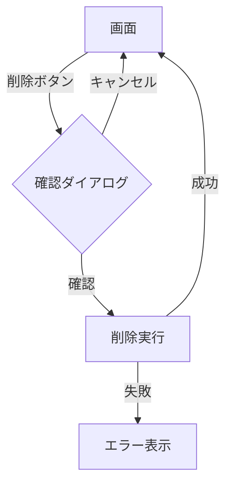

### ネストしたモーダル

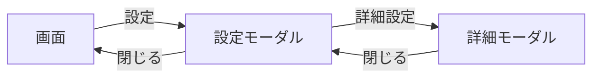

### フルスクリーンモーダル

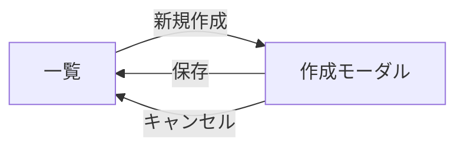

---

## タブ・ステップ

### タブ切り替え

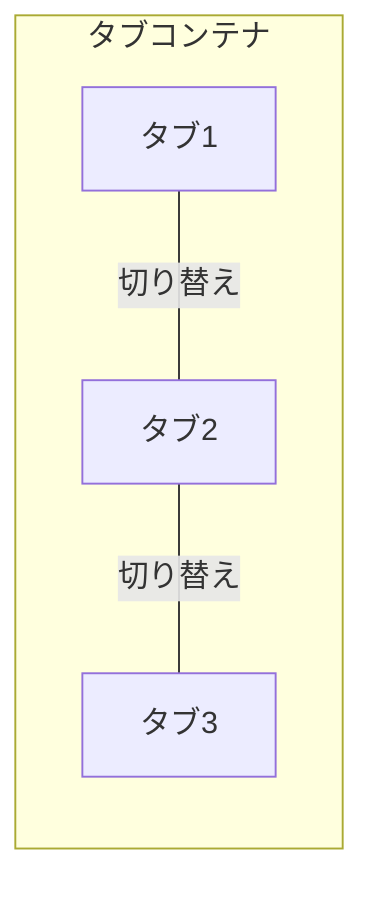

- URLは変更しない（同一画面内）
- または `/page?tab=1` のようにクエリパラメータで管理

### ウィザードステップ

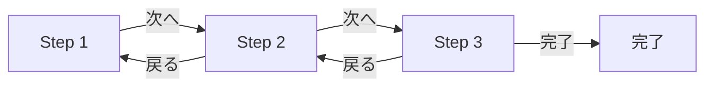

### パラメータ

| パターン | パラメータ | 説明 |
|----------|-----------|------|
| タブ | tab | アクティブなタブID |
| ステップ | step | 現在のステップ番号 |
| ステップ | formData | 累積フォームデータ |

---

## エラーフロー

### APIエラー

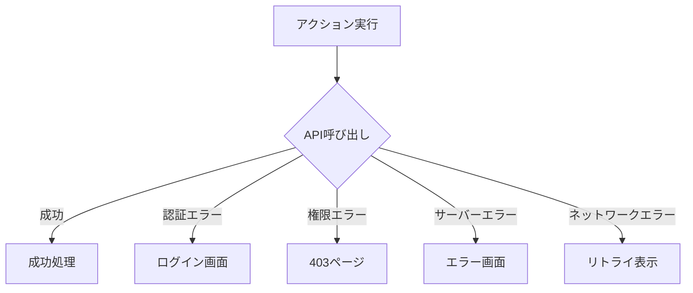

### 404パターン

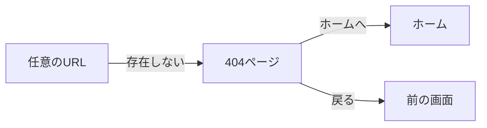

### セッション切れ

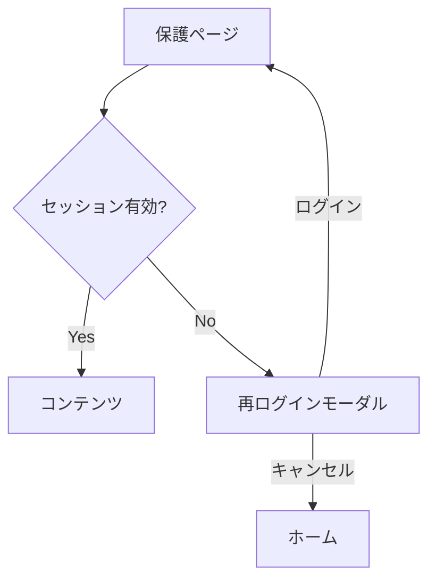

---

## Mermaid記法

### 基本構文

```mermaid
flowchart LR
    A[四角] --> B[四角]
    A --> C(丸角)
    A --> D{ひし形}
    A --> E((円))
```

### 方向

| 記法 | 方向 |
|------|------|
| `flowchart LR` | 左から右 |
| `flowchart RL` | 右から左 |
| `flowchart TD` | 上から下 |
| `flowchart BT` | 下から上 |

### ノード形状

| 記法 | 形状 | 用途 |
|------|------|------|
| `[テキスト]` | 四角 | 画面 |
| `(テキスト)` | 丸角四角 | 処理 |
| `{テキスト}` | ひし形 | 分岐 |
| `((テキスト))` | 円 | 開始/終了 |
| `[[テキスト]]` | 二重四角 | サブルーチン |

### 矢印

| 記法 | 意味 |
|------|------|
| `-->` | 通常の矢印 |
| `-->｜ラベル｜` | ラベル付き矢印 |
| `---` | 線（矢印なし） |
| `-.->` | 点線矢印 |
| `==>` | 太い矢印 |

### サブグラフ

```mermaid
flowchart LR
    subgraph 認証
        Login[ログイン]
        Register[登録]
    end
    
    subgraph メイン
        Home[ホーム]
        List[一覧]
    end
    
    Login --> Home
    Register --> Home
```

### スタイル

```mermaid
flowchart LR
    A[通常] --> B[強調]
    style B fill:#f9f,stroke:#333,stroke-width:2px
```

---

## 複合パターン例

### ECサイトフロー

```mermaid
flowchart TD
    Home[ホーム] --> List[商品一覧]
    List --> Detail[商品詳細]
    Detail --> Cart[カート]
    Cart --> Checkout[購入手続き]
    Checkout --> Confirm[確認]
    Confirm --> Complete[完了]
    
    Detail -->|お気に入り| Favorite{ログイン済み?}
    Favorite -->|Yes| AddFav[お気に入り追加]
    Favorite -->|No| Login[ログイン]
    Login --> Detail
```

### 管理画面フロー

```mermaid
flowchart TD
    Dashboard[ダッシュボード] --> Users[ユーザー一覧]
    Dashboard --> Products[商品一覧]
    Dashboard --> Orders[注文一覧]
    
    Users --> UserDetail[ユーザー詳細]
    UserDetail --> UserEdit[ユーザー編集]
    
    Products --> ProductDetail[商品詳細]
    ProductDetail --> ProductEdit[商品編集]
    Products --> ProductCreate[商品作成]
```

### SNSアプリフロー

```mermaid
flowchart LR
    subgraph TabBar
        Feed[フィード]
        Search[検索]
        Create[投稿]
        Notifications[通知]
        Profile[プロフィール]
    end
    
    Feed --> PostDetail[投稿詳細]
    PostDetail --> UserProfile[ユーザープロフィール]
    Search --> UserProfile
    Create --> PostEdit[投稿編集]
    PostEdit --> Feed
```
