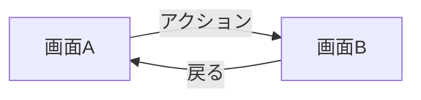
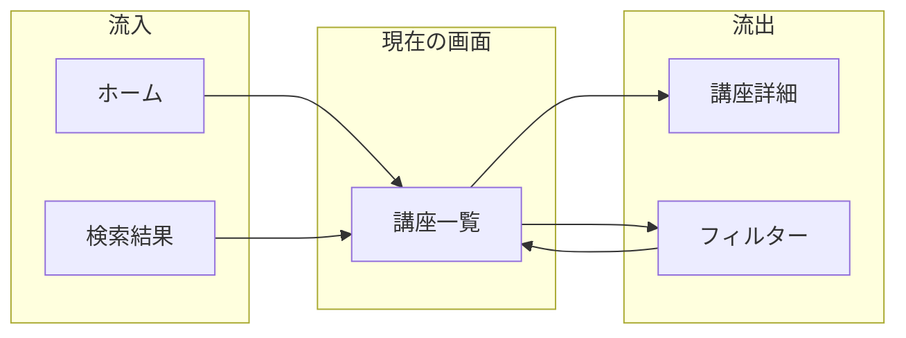
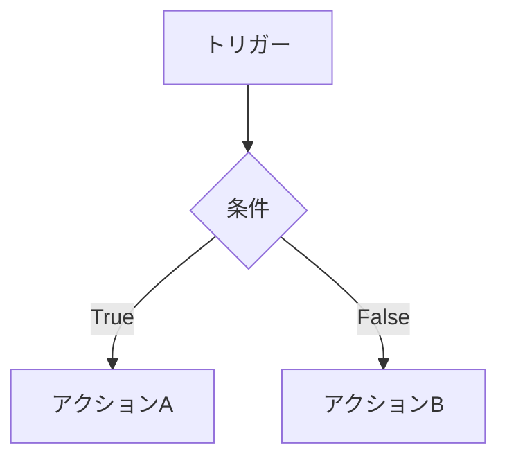
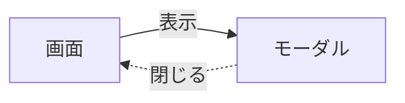

# 画面フロー整理ワークフロー

画面間のナビゲーションフローを整理する詳細な手順です。

## 概要

```
1. spec.md の存在確認
   └─> なければ初期化

2. 遷移トリガーを検出
   └─> リンク、ボタン、カード等

3. 遷移先を特定
   └─> 各トリガーの遷移先画面

4. 遷移パラメータを整理
   └─> 画面間で受け渡すデータ

5. 条件分岐を整理
   └─> 条件による遷移先の違い

6. フロー図を生成
   └─> Mermaid形式で可視化

7. spec.md の「画面フロー」セクションを更新
```

---

## Step 0: spec.md の存在確認

### 実行

```bash
ls .outputs/{screen-id}/spec.md
```

### 遷移がない場合

他画面への遷移がない場合：

```markdown
## 画面フロー

> **ステータス**: 該当なし  
> **生成スキル**: documenting-screen-flows  
> **更新日**: {DATE}

この画面には他画面への遷移がありません。
```

---

## Step 1: 遷移トリガーを検出

### 情報源

1. **生成済みHTML**: リンク、ボタン要素
2. **Figmaプロトタイプ**: インタラクション設定
3. **extracting-interactions の結果**: 画面遷移セクション

### 検出対象

| 要素 | 検出方法 |
|------|---------|
| リンク | `<a href="...">`、`data-figma-content="link"` |
| ナビゲーションボタン | `<button>` + 遷移アクション |
| カード | クリッカブルカード、`data-figma-content="card"` |
| フォーム送信 | `<form>` + submit |
| モーダルトリガー | `data-modal-target`、aria-controls |
| 戻るボタン | 戻るアイコン/テキスト |

### 出力形式

```yaml
triggers:
  - id: course-card
    element: 講座カード
    type: click
    count: 複数
    
  - id: filter-button
    element: フィルターボタン
    type: click
    
  - id: search-form
    element: 検索フォーム
    type: submit
    
  - id: back-button
    element: 戻るボタン
    type: click
```

---

## Step 2: 遷移先を特定

### Figmaプロトタイプから

```bash
mcp__figma__get_metadata(fileKey, nodeId)
```

プロトタイプリンクがある場合、遷移先フレームを特定。

### HTMLから推測

| トリガー | 推測方法 |
|----------|---------|
| リンク | href属性 |
| カード | data-href、リンクラッパー |
| フォーム | action属性、成功時遷移先 |
| モーダル | aria-controls、data-modal |

### 出力形式

```yaml
transitions:
  - trigger: course-card
    destination: 講座詳細画面
    destination_id: course-detail
    type: push
    
  - trigger: filter-button
    destination: フィルターモーダル
    destination_id: filter-modal
    type: modal
    
  - trigger: search-form
    destination: 検索結果画面
    destination_id: search-results
    type: push
    
  - trigger: back-button
    destination: 前の画面
    destination_id: previous
    type: pop
```

### 遷移タイプの判定

| 条件 | タイプ |
|------|--------|
| 通常のナビゲーション | push |
| 戻るボタン | pop |
| モーダル/ダイアログ | modal |
| ログアウト後のリダイレクト | reset |
| 同一画面内の切り替え | replace |

---

## Step 3: 遷移パラメータを整理

### パラメータの検出

| 検出方法 | 例 |
|----------|-----|
| URLパラメータ | `/courses/:courseId` |
| クエリパラメータ | `/search?query=xxx` |
| 状態（State） | 遷移時に渡すオブジェクト |

### パラメータ定義

各パラメータについて：

```yaml
parameters:
  - name: courseId
    type: string
    required: true
    description: 講座の一意識別子
    source: カードのdata-id属性
    example: "course-123"
    used_by:
      - 講座詳細画面
      
  - name: query
    type: string
    required: false
    description: 検索キーワード
    source: 検索入力フィールド
    example: "プログラミング"
    used_by:
      - 検索結果画面
      - 講座一覧（フィルター後）
```

### パラメータ表

```markdown
| パラメータ | 型 | 必須 | 説明 | 例 |
|-----------|-----|:----:|------|-----|
| courseId | string | ✓ | 講座ID | "course-123" |
| query | string | - | 検索キーワード | "プログラミング" |
| categoryId | string | - | カテゴリID | "cat-web" |
```

---

## Step 4: 条件分岐を整理

### 分岐の検出

| 分岐条件 | 例 |
|----------|-----|
| 認証状態 | ログイン済み / 未ログイン |
| 権限 | 管理者 / 一般ユーザー |
| データ状態 | データあり / なし |
| フォーム状態 | 有効 / エラーあり |
| 環境 | 本番 / テスト |

### 分岐の整理

```yaml
branches:
  - condition: ログイン済み
    trigger: お気に入りボタン
    true_action: お気に入り追加（API）
    false_action: ログインモーダル表示
    
  - condition: 検索結果あり
    trigger: 検索実行
    true_action: 結果一覧表示
    false_action: Empty状態表示（遷移なし）
    
  - condition: フォーム有効
    trigger: 送信ボタン
    true_action: 確認画面へ
    false_action: エラー表示（遷移なし）
```

### 分岐表

```markdown
| 条件 | トリガー | True時 | False時 |
|------|----------|--------|---------|
| ログイン済み | お気に入りボタン | API実行 | ログインモーダル |
| 検索結果あり | 検索実行 | 結果表示 | Empty表示 |
| フォーム有効 | 送信ボタン | 確認画面 | エラー表示 |
```

---

## Step 5: フロー図を生成

### Mermaid記法の基本



### 流入・流出の表現



### 条件分岐の表現



### モーダルの表現



点線（`-.->）でモーダルの戻りを表現。

---

## Step 6: spec.md の「画面フロー」セクションを更新

### 更新手順

1. **セクションを特定**

```markdown
<!-- 
================================================================================
SECTION: 画面フロー
Generated by: documenting-screen-flows
================================================================================
-->

## 画面フロー
```

2. **ステータスを更新**

```markdown
> **ステータス**: 完了 ✓  
> **生成スキル**: documenting-screen-flows  
> **更新日**: {DATE}
```

3. **プレースホルダー `{{SCREEN_FLOWS_CONTENT}}` を内容に置換**

4. **完了チェックリストを更新**

```markdown
- [x] 画面フロー (documenting-screen-flows)
```

5. **変更履歴に追記**

```markdown
| {DATE} | 画面フロー | documenting-screen-flowsにより生成 |
```

### 検証

- [ ] セクションが更新されている
- [ ] ステータスが「完了 ✓」または「該当なし」
- [ ] 流入元が整理されている
- [ ] 流出先が整理されている
- [ ] パラメータが明確
- [ ] 条件分岐が整理されている
- [ ] フロー図が含まれている

---

## エラーハンドリング

### 遷移先が特定できない

```
対処:
1. Figmaプロトタイプを確認
2. 「要確認」として明示
3. 一般的なパターンから推測
```

### 複雑な条件分岐

```
対処:
1. 主要な分岐のみ記載
2. 詳細は「特記事項」に記載
3. 必要に応じて別途フロー図を作成
```

### 循環参照

```
対処:
1. 循環を明示的に記載
2. 戻りの遷移を点線で表現
3. 「循環フロー」として注記
```

---

## 他スキルとの連携

### extracting-interactions から

「画面遷移」セクションの情報を活用：

```markdown
### 画面遷移

| 起点 | アクション | 遷移先 | アニメーション |
|------|----------|--------|---------------|
| この画面 | カードクリック | 講座詳細 | push |
```

### documenting-ui-states から

状態による遷移の違いを確認：

- Loading状態 → 遷移無効
- Error状態 → リトライで再遷移
- Empty状態 → 遷移なし
