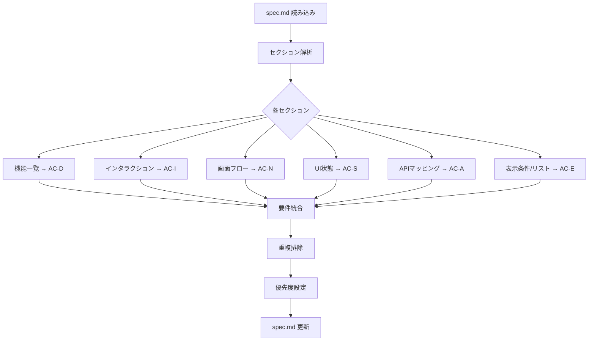

# Acceptance Criteria Generation Workflow

受け入れ要件生成の詳細ワークフローです。

## フロー概要



## 詳細ステップ

### Step 1: spec.md 読み込み

```bash
# spec.md のパスを特定
Read: .outputs/{screen-id}/spec.md
```

**確認項目:**
- [ ] ファイルが存在する
- [ ] 必要なセクションが含まれている

**必須セクション:**
- 機能一覧（`### 機能一覧`）
- インタラクション（`## インタラクション`）

**オプションセクション:**
- 画面フロー（`## 画面フロー`）
- UI状態（`## UI状態`）
- APIマッピング（`## APIマッピング`）
- 表示条件（`### 表示条件`）
- リストデータ（`### リストデータ`）

### Step 2: 機能一覧から AC-D を抽出

**入力パターン:**
```markdown
### 機能一覧

| 機能 | 説明 |
|------|------|
| {機能名} | {説明} |
```

**抽出アルゴリズム:**
```
for each row in 機能一覧:
    AC-D{番号}:
        name = row.機能
        Given = "正常なデータが存在する" (default)
        When = "画面を表示する" (default)
        Then = row.説明 + "される"
        priority = "必須"
```

**出力:**
```markdown
### AC-D01: {機能名}

| ID | Given | When | Then | 優先度 |
|----|-------|------|------|--------|
| 01 | 正常なデータが存在する | 画面を表示する | {説明}される | 必須 |
```

### Step 3: インタラクションから AC-I を抽出

**入力パターン:**
```markdown
### インタラクティブ要素一覧

| 要素 | data-figma-interaction | data-figma-states | 説明 |
|------|------------------------|-------------------|------|
| {要素名} | {interaction} | {states} | {説明} |
```

**interaction パターン別変換:**

| パターン | Given | When | Then |
|----------|-------|------|------|
| `tap:navigate:{target}` | 画面を表示している | {要素}をタップする | {target}画面へ遷移する |
| `tap:toggle:{state}` | {state}がOFFの状態 | {要素}をタップする | {state}がONになる |
| `click:show-modal:{modal}` | モーダルが非表示 | {要素}をクリックする | {modal}が表示される |
| `tap:toggle:tab` | {tabA}が選択状態 | {tabB}をタップする | {tabB}が選択状態になる |

**states からの追加シナリオ:**
```
if states contains "default,active":
    シナリオ追加: default → active
    シナリオ追加: active → default

if states contains "default,bookmarked":
    シナリオ追加: 未ブックマーク → ブックマーク済み
    シナリオ追加: ブックマーク済み → 未ブックマーク
```

### Step 4: 画面フローから AC-N を抽出

**入力パターン:**
```markdown
### 流入遷移

| 遷移元 | トリガー | 遷移パラメータ | 備考 |
|--------|----------|----------------|------|

### 流出遷移

| 遷移先 | トリガー | 遷移パラメータ | 条件 |
|--------|----------|----------------|------|
```

**流入遷移の変換:**
```
for each row in 流入遷移:
    AC-N{番号}:
        name = "{遷移元}からの遷移"
        Given = "{遷移元}画面を表示している"
        When = "{トリガー}"
        Then = "本画面に遷移する"
        if 遷移パラメータ != "なし":
            Then += "（パラメータ: {遷移パラメータ}）"
```

**流出遷移の変換:**
```
for each row in 流出遷移:
    AC-N{番号}:
        name = "{遷移先}への遷移"
        Given = "本画面を表示している"
        if 条件:
            Given += " AND {条件}"
        When = "{トリガー}"
        Then = "{遷移先}画面に遷移する"
```

### Step 5: UI状態から AC-S を抽出

**入力パターン:**
```markdown
### 状態一覧

| 状態 | 条件 | Figma Node |
|------|------|------------|
| {状態名} | {条件} | {nodeId} |
```

**変換:**
```
for each row in 状態一覧:
    AC-S{番号}:
        name = "{状態名}状態の表示"
        Given = "{条件}"
        When = "画面を表示する"
        Then = "{状態名}状態が表示される"
```

**状態遷移からの追加:**
```markdown
### 状態遷移表

| From | To | トリガー | 条件 |
|------|-----|----------|------|
```

```
for each row in 状態遷移表:
    AC-S{番号}:
        name = "{From}から{To}への遷移"
        Given = "{From}状態である"
        if 条件:
            Given += " AND {条件}"
        When = "{トリガー}"
        Then = "{To}状態に変化する"
```

### Step 6: APIマッピングから AC-A を抽出

**入力パターン:**
```markdown
### HTMLへのAPIフィールドバインディング

| HTML要素 | data-api-field | APIフィールド | 変換処理 |
|----------|----------------|---------------|----------|
```

**変換:**
```
for each row in APIバインディング:
    AC-A{番号}:
        name = "{HTML要素}のデータ表示"
        Given = "APIが{APIフィールド}を含むレスポンスを返す"
        When = "画面を表示する"
        if 変換処理:
            Then = "{変換処理}された値が{HTML要素}に表示される"
        else:
            Then = "{APIフィールド}の値が{HTML要素}に表示される"
```

**API呼び出しからの追加:**
```markdown
### 履歴取得API

| 項目 | 値 |
|------|-----|
| エンドポイント | `GET /api/xxx` |
| タイミング | 画面表示時 |
```

```
AC-A{番号}:
    name = "API呼び出し"
    Given = "ユーザーが認証済み"
    When = "画面を表示する"
    Then = "{エンドポイント}が呼び出される"
```

### Step 7: 表示条件・リストデータから AC-E を抽出

**表示条件パターン:**
```markdown
### 表示条件

| 条件 | 動作 |
|------|------|
| {条件} | {動作} |
```

**変換:**
```
for each row in 表示条件:
    AC-E{番号}:
        name = "{条件}時の動作"
        Given = "{条件}"
        When = "画面を表示する"
        Then = "{動作}"
```

**リストデータパターン:**
```markdown
### リストデータ

| リストID | 最小件数 | 最大件数 | 空時の表示 |
|----------|----------|----------|------------|
```

**変換:**
```
for each row in リストデータ:
    # 空時
    AC-E{番号}:
        name = "{リストID}が空の場合"
        Given = "{リストID}のデータが0件"
        When = "画面を表示する"
        Then = "{空時の表示}が表示される"

    # 最大件数（有限の場合）
    if 最大件数 != "無制限":
        AC-E{番号}:
            name = "{リストID}が最大件数の場合"
            Given = "{リストID}のデータが{最大件数}件以上"
            When = "画面を表示する"
            Then = "ページネーション/スクロールが機能する"
```

### Step 8: 重複排除・優先度設定

**重複排除ロジック:**
```
duplicates = []
for i, ac1 in enumerate(all_criteria):
    for ac2 in all_criteria[i+1:]:
        if similar(ac1.given, ac2.given) and
           similar(ac1.when, ac2.when) and
           similar(ac1.then, ac2.then):
            duplicates.append(ac2)

unique_criteria = [ac for ac in all_criteria if ac not in duplicates]
```

**優先度設定ルール:**

| 条件 | 優先度 |
|------|--------|
| 機能一覧から抽出 | 必須 |
| 正常系インタラクション | 必須 |
| 画面遷移（主要フロー） | 必須 |
| エラーハンドリング | 推奨 |
| エッジケース（空、境界値） | 推奨 |
| 状態遷移（副次的） | 推奨 |
| API詳細バインディング | 任意 |

### Step 9: spec.md の更新

**更新箇所:**
1. `## 受け入れ要件` セクションの内容を置換
2. ステータスを更新
3. 完了チェックリストを更新
4. 変更履歴に追記

**更新テンプレート:**
```markdown
## 受け入れ要件

<!-- @generated-by: generating-acceptance-criteria | @timestamp: {DATE} -->

### 表示要件 (AC-D)

{AC-D 要件一覧}

### 操作要件 (AC-I)

{AC-I 要件一覧}

### 遷移要件 (AC-N)

{AC-N 要件一覧}

### 状態要件 (AC-S)

{AC-S 要件一覧}

### API要件 (AC-A)

{AC-A 要件一覧}

### エッジケース要件 (AC-E)

{AC-E 要件一覧}

### 非機能要件

| ID | 要件 | 基準値 | 測定方法 |
|----|------|--------|----------|
| NFR-01 | 初回表示時間 | 3秒以内 | Lighthouse |
```

## エラーハンドリング

### セクションが見つからない場合

```
if セクションが存在しない:
    警告を出力: "セクション '{name}' が見つかりません。スキップします。"
    continue
```

### テーブルのパースエラー

```
if テーブル形式が不正:
    警告を出力: "テーブル形式が不正です: {line}"
    continue
```

## 出力例

履歴画面の spec.md から生成される受け入れ要件の例は [examples.md](examples.md) を参照。
