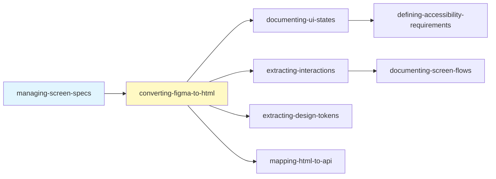

# セクション責任マッピング

各スキルが担当するセクションと主なプレースホルダーの対応表。

## セクション別担当

| セクション | 担当スキル | 主なプレースホルダー |
|-----------|-----------|---------------------|
| 概要 | managing-screen-specs | `{{SCREEN_NAME}}`, `{{FIGMA_URL}}`, `{{HTML_FILE}}`, `{{DESCRIPTION}}` |
| 構造・スタイル | converting-figma-to-html | `{{HTML_STRUCTURE}}`, `{{SCREEN_ID}}`, `{{ROOT_NODE_ID}}` |
| コンテンツ分析 | converting-figma-to-html | `{{CONTENT_NAME}}`, `{{DATA_ATTRIBUTE}}`, `{{API_SOURCE}}` |
| UI状態 | documenting-ui-states | `{{ELEMENT_NAME}}`, `{{ELEMENT_STATE}}`, ボタン状態各種 |
| インタラクション | extracting-interactions | `{{INTERACTION_NAME}}`, `{{TRIGGER}}`, `{{ACTION}}`, `{{DESTINATION}}` |
| フォーム仕様 | defining-form-specs | （必要時に追加） |
| APIマッピング | mapping-html-to-api | `{{API_MAPPING_DESCRIPTION}}` |
| アクセシビリティ | defining-accessibility-requirements | `{{ELEMENT}}`, `{{ROLE}}`, `{{ARIA_ATTRS}}` |
| デザイントークン | extracting-design-tokens | カラー/タイポグラフィ/スペーシングトークン |
| 画面フロー | documenting-screen-flows | `{{CURRENT_SCREEN}}`, `{{NEXT_SCREEN}}` |
| 変更履歴 | 全スキル | `{{DATE}}`, 変更内容 |

## 更新ルール

### 必須

- 自分の担当セクションのみを更新する
- 変更履歴に記録を追加する
- プレースホルダーを具体的な内容に置換する

### 禁止

- 他のセクションの内容を変更しない
- プレースホルダーを削除せずに残さない

## 更新順序（推奨）

1. **managing-screen-specs**: 初期化、概要
2. **converting-figma-to-html**: 構造、コンテンツ分析
3. **documenting-ui-states**: UI状態
4. **extracting-interactions**: インタラクション
5. **extracting-design-tokens**: デザイントークン
6. **defining-accessibility-requirements**: アクセシビリティ
7. **documenting-screen-flows**: 画面フロー
8. **mapping-html-to-api**: APIマッピング
