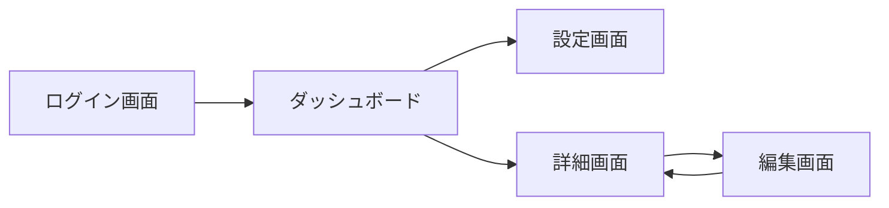
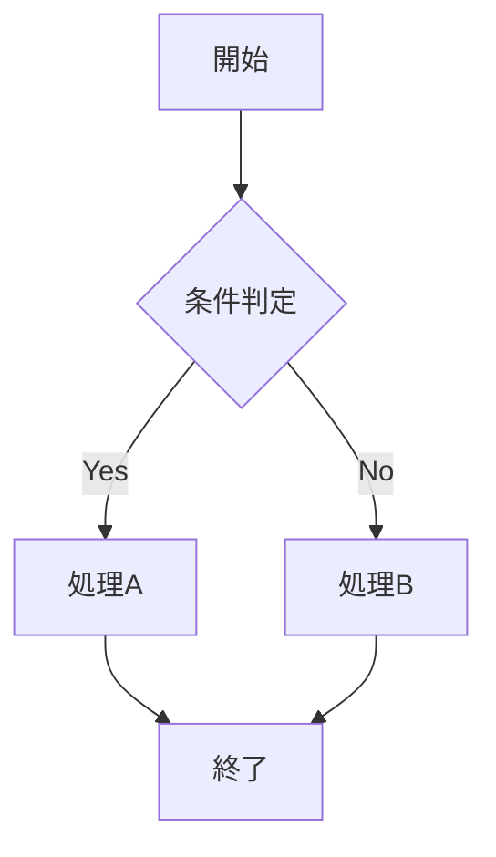
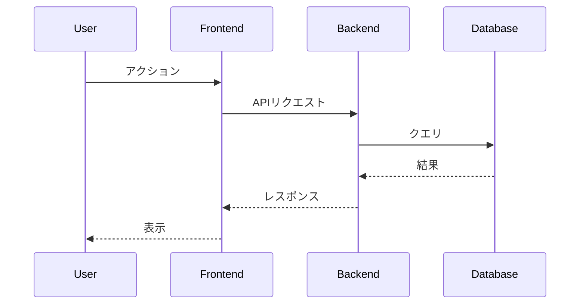
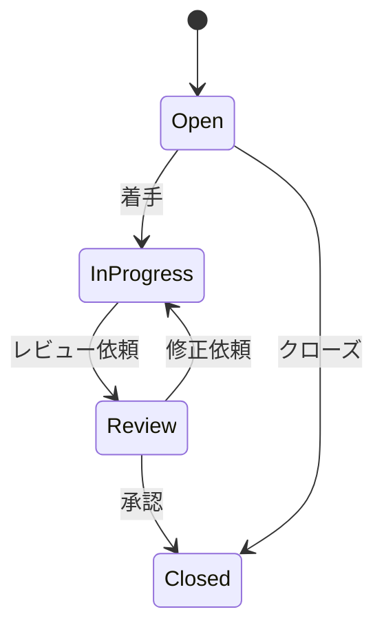
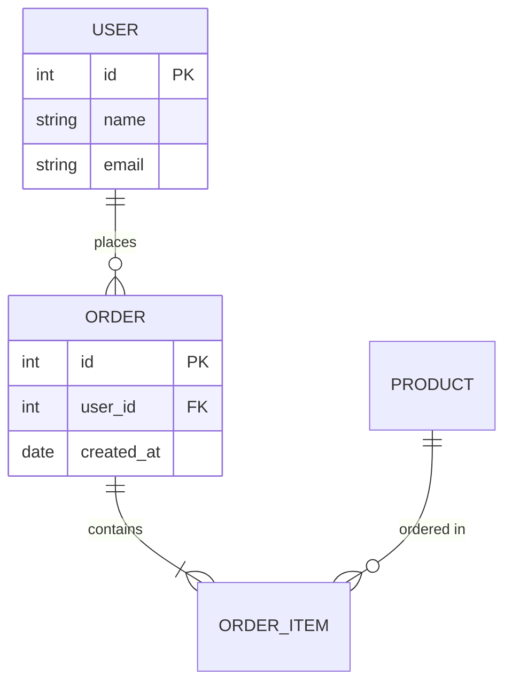
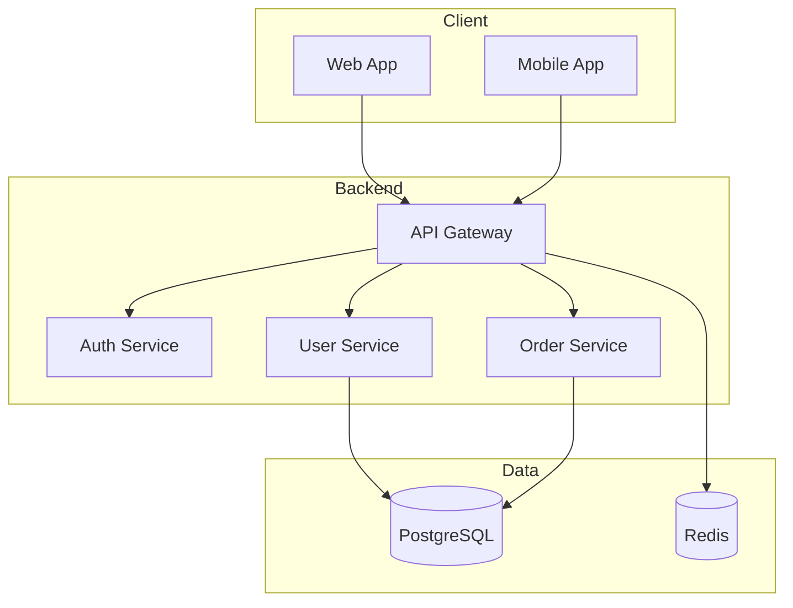
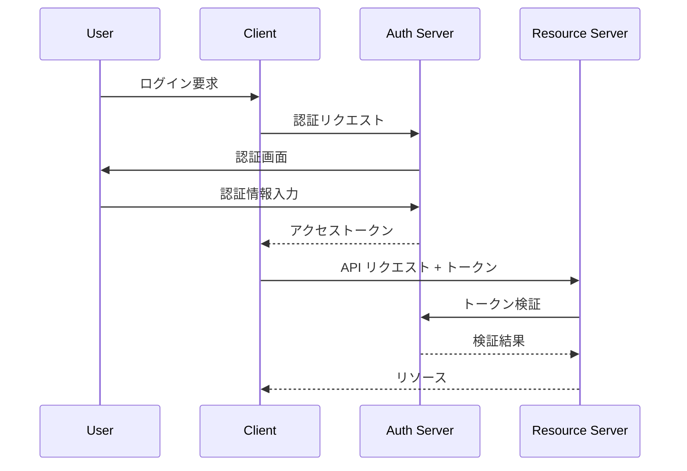
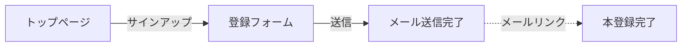
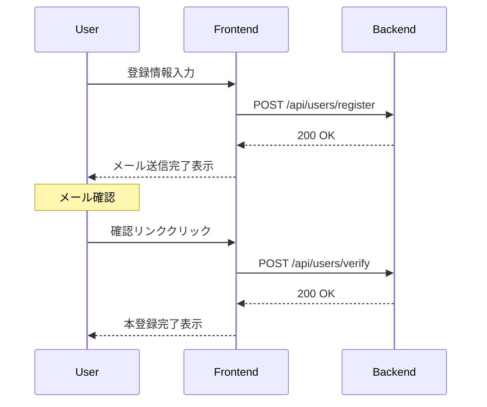

# Visualize Issue Command

## 目次

1. [概要](#概要)
2. [使用方法](#使用方法)
3. [実行手順](#実行手順)
   - [Step 1: Issue情報の取得](#step-1-issue情報の取得)
   - [Step 2: コンテンツ解析](#step-2-コンテンツ解析)
   - [Step 3: 図表の生成](#step-3-図表の生成)
   - [Step 4: 出力](#step-4-出力)
4. [図表タイプ](#図表タイプ)
5. [出力例](#出力例)
6. [エラーハンドリング](#エラーハンドリング)

---

## 概要

GitHub issueのURLを受け取り、その内容をmermaid図やテーブルでビジュアライズします。

**特徴**:
- issueの仕様から**画面遷移図**、**フローチャート**、**シーケンス図**を自動生成
- 関連issueの**依存関係図**を生成
- 本文・コメント・sub issueから**結論・決定事項**を抽出
- 散在する情報から**仕様を整理**して記載
- **原文を折りたたみで保持**し、トレーサビリティを確保

## 使用方法

```bash
/visualize-issue <issue-url> [diagram-type]
```

**引数**:

- `issue-url` (必須): GitHub IssueのURL
  - 例: `https://github.com/owner/repo/issues/123`
- `diagram-type` (省略可): 生成する図のタイプ
  - `all` (デフォルト): すべての図を生成
  - `screen`: 画面遷移図のみ
  - `flow`: フローチャートのみ
  - `sequence`: シーケンス図のみ
  - `state`: 状態遷移図のみ
  - `er`: ER図のみ
  - `api`: API I/F テーブルのみ
  - `arch`: アーキテクチャ図のみ
  - `auth`: 認証・認可フローのみ

**使用例**:

```bash
/visualize-issue https://github.com/owner/repo/issues/123
/visualize-issue https://github.com/owner/repo/issues/123 flow
/visualize-issue https://github.com/owner/repo/issues/123 sequence
```

## 実行手順

### Step 1: Issue情報の取得

GitHub CLIを使用してissue情報を取得します。

```bash
# Issue基本情報
gh issue view <issue-url> --json title,body,state,labels,milestone,createdAt,updatedAt,comments,author

# 関連issue（リンクされているissue）
gh api repos/{owner}/{repo}/issues/{number}/timeline

# Sub issues（子issue）の取得
# issue本文内の "sub issues" セクションや、リンクされたissueを解析
# または GitHub Projects の親子関係を確認
```

**取得対象**:
- issue本文（body）
- 全コメント（comments）
- 関連・リンクされたissue
- sub issues（本文内のリンクから抽出）
- 関連PR（本文・コメント内のリンクから抽出）

### Step 2: コンテンツ解析

issueのbodyとコメントを解析し、図表化可能な要素を抽出します。

#### 検出パターン

##### 基本パターン

| 要素 | 検出キーワード | 出力形式 |
|------|---------------|----------|
| **画面遷移** | `画面`, `ページ`, `遷移`, `screen`, `page` | mermaid flowchart LR |
| **処理フロー** | `ステップ`, `手順`, `flow`, `step` + 条件分岐 | mermaid flowchart TD |
| **シーケンス** | `リクエスト`, `レスポンス`, `呼び出し`, 複数システム名 | mermaid sequenceDiagram |
| **状態遷移** | `状態`, `ステータス`, `state`, `status`, `→` + 状態名 | mermaid stateDiagram |
| **タスク** | `## タスク`, `1.`, `2.`, チェックボックス | **リスト形式のまま** |

##### データ系パターン

| 要素 | 検出キーワード | 出力形式 |
|------|---------------|----------|
| **ER図** | `テーブル`, `カラム`, `PK`, `FK`, `リレーション`, `外部キー` | mermaid erDiagram |
| **データフロー** | `データ`, `変換`, `入力`, `出力`, `インプット`, `アウトプット` | mermaid flowchart LR |

##### API/インターフェース系パターン

| 要素 | 検出キーワード | 出力形式 |
|------|---------------|----------|
| **API エンドポイント** | `GET`, `POST`, `PUT`, `DELETE`, `エンドポイント`, `/api/` | table |
| **リクエスト/レスポンス** | `リクエスト`, `レスポンス`, `ボディ`, `パラメータ` | table / JSON |
| **認証・認可** | `認証`, `認可`, `OAuth`, `JWT`, `トークン`, `権限`, `ロール` | mermaid sequenceDiagram |

##### アーキテクチャ系パターン

| 要素 | 検出キーワード | 出力形式 |
|------|---------------|----------|
| **システム構成** | `アーキテクチャ`, `構成`, `マイクロサービス`, `コンポーネント` | mermaid flowchart |
| **デプロイ/環境** | `dev`, `stg`, `prod`, `環境`, `デプロイ`, `インフラ` | mermaid flowchart |
| **依存関係** | `依存`, `接続`, `連携`, `→`, 複数サービス名 | mermaid flowchart |

##### 運用系パターン

| 要素 | 検出キーワード | 出力形式 |
|------|---------------|----------|
| **CI/CD** | `パイプライン`, `ビルド`, `テスト`, `デプロイ`, `CI`, `CD` | mermaid flowchart LR |
| **ジョブ/バッチ** | `job`, `ジョブ`, `バッチ`, `cron`, `スケジュール` | mermaid gantt / flowchart |
| **エラーハンドリング** | `エラー`, `例外`, `リトライ`, `フォールバック` | mermaid flowchart TD |

##### 業務/ドメイン系パターン

| 要素 | 検出キーワード | 出力形式 |
|------|---------------|----------|
| **承認フロー** | `承認`, `申請`, `レビュー`, `ワークフロー` | mermaid flowchart TD |
| **契約/料金** | `契約`, `プラン`, `料金`, `課金` | table / stateDiagram |
| **ユーザー種別** | `ロール`, `権限`, `管理者`, `ユーザー`, `ゲスト` | table |

##### 結論・決定事項パターン

| 要素 | 検出キーワード | 出力形式 |
|------|---------------|----------|
| **決定事項** | `← こちらでいく`, `に決定`, `で進める`, `確定`, `決まり` | table |
| **却下案** | `却下`, `不採用`, `見送り`, `NG`, `デメリット` | table（決定事項に併記） |
| **合意事項** | `合意`, `了承`, `OK`, `LGTM`, `👍`, `:+1:` | table |
| **前提条件** | `前提`, `前提条件`, `制約`, `条件` | table |
| **背景・理由** | `背景`, `理由`, `なぜなら`, `ため`, `メリット` | 決定事項の根拠として |

##### 仕様パターン

| 要素 | 検出キーワード | 出力形式 |
|------|---------------|----------|
| **要件** | `要件`, `必須`, `MUST`, `SHOULD`, `仕様` | table |
| **制約** | `制約`, `制限`, `上限`, `下限`, `〜以上`, `〜以下` | table |
| **フォーマット** | `フォーマット`, `形式`, `CSV`, `JSON`, `カラム` | table / code block |
| **バリデーション** | `バリデーション`, `検証`, `チェック`, `エラー` | table / flowchart |
| **ビジネスルール** | `ルール`, `条件`, `場合`, `とき`, `〜なら` | table |

**重要**: タスクリスト（実装タスク、ToDoなど）はmermaid図に変換せず、元のリスト形式を維持する。

#### 結論抽出ルール

1. **決定マーカーの検出**: `← こちらでいく`、`で進める`、チェックボックスで選択されたもの
2. **コメント内の合意**: 最終コメントでの合意、👍リアクションの多い選択肢
3. **却下理由の収集**: 選ばれなかった選択肢とその理由
4. **時系列での追跡**: 議論の変遷を追い、最終決定を特定

#### 仕様整理ルール

1. **散在情報の統合**: 本文・コメント・sub issueから同じトピックの情報を集約
2. **最新情報の優先**: 後のコメントで更新された内容を優先
3. **矛盾の検出**: 矛盾する記述がある場合は明示
4. **未決定事項の明示**: 決まっていない項目は「未決定」と明記

#### 抽出ルール

1. **見出し（##）**: セクション区切りとして認識
2. **リスト（-/1.）**: 手順・フロー要素として認識
3. **矢印（→/->）**: 遷移・依存関係として認識
4. **チェックボックス（- [ ]）**: タスクとして認識
5. **コードブロック**: API/データ構造として認識

### Step 3: 図表の生成

解析結果に基づき、適切な図表を生成します。

#### 3.1 画面遷移図（flowchart LR）

画面/ページ間の遷移を可視化:



#### 3.2 フローチャート（flowchart TD）

処理フロー・判断ロジックを可視化:



#### 3.3 シーケンス図（sequenceDiagram）

API呼び出し・コンポーネント間通信を可視化:



#### 3.4 状態遷移図（stateDiagram-v2）

状態の変化を可視化:



#### 3.5 ER図（erDiagram）

テーブル設計・リレーションを可視化:



#### 3.6 API エンドポイント（table）

REST API 設計を表形式で可視化:

| Method | Endpoint | 説明 | Request | Response |
|--------|----------|------|---------|----------|
| GET | `/api/users` | ユーザー一覧取得 | - | `User[]` |
| POST | `/api/users` | ユーザー作成 | `{name, email}` | `User` |
| GET | `/api/users/:id` | ユーザー詳細取得 | - | `User` |

#### 3.7 アーキテクチャ図（flowchart）

システム構成・マイクロサービス間の関係を可視化:



#### 3.8 認証・認可フロー（sequenceDiagram）

OAuth/JWT などの認証フローを可視化:



#### Mermaid記述ルール

mermaid図を生成する際は以下のルールに従う：

| ルール | 説明 | 例 |
|--------|------|-----|
| 改行禁止 | ノード内で `\n` を使用しない | ❌ `A["行1\n行2"]` → ✅ `A["行1 行2"]` |
| 日本語はダブルクォート | 日本語テキストは必ず `"` で囲む | ✅ `A["ログイン画面"]` |
| 1行で完結 | 各ノード・エッジは1行で記述 | ✅ `A --> B --> C` |

**理由**: GitHubのMarkdownレンダラーでは `\n` が正しく解釈されない場合がある。

### Step 4: 出力

生成した図表をMarkdown形式で出力します。

```markdown
# Issue Visualization: [Issue Title]

## サマリー

[issueの目的・概要を1-2文で簡潔に記述。「〜を実現するため、〜を実装する」形式で書く]

---

## 結論・決定事項

議論から抽出した最終決定をまとめる。

| 項目 | 決定 | 却下案 | 根拠 |
|------|------|--------|------|
| [検討項目1] | [採用案] | [不採用案1] / [不採用案2] | [コメント#N (@user)](comment-url) |
| [検討項目2] | [採用案] | - | [本文](issue-url) |

**根拠列のルール**:
- 可能な限りコメントや本文へのパーマリンクを貼る
- 複数の却下案がある場合は `/` で区切る
- 却下案がない場合は `-` を記載

### 前提条件
- [前提1]
- [前提2]

---

## 仕様

散在する情報を整理した仕様。

### 機能要件

| 項目 | 仕様 | 備考 |
|------|------|------|
| [機能1] | [詳細] | [補足] |
| [機能2] | [詳細] | [補足] |

### データ仕様

| フィールド | 型 | 説明 | 制約 |
|-----------|------|------|------|
| [field1] | [type] | [description] | [constraints] |

### ビジネスルール

| ルール | 条件 | アクション |
|--------|------|----------|
| [rule1] | [condition] | [action] |

### 未決定事項

- [ ] [未決定項目1]
- [ ] [未決定項目2]

---

## 図表

### アーキテクチャ図
[mermaid diagram]

### 画面遷移図
[mermaid diagram]

### シーケンス図
[mermaid diagram]

### 状態遷移図
[mermaid diagram]

---

## タスク

[元のリスト形式をそのまま維持 - mermaid図にしない]

---

## 抽出した要素

| 種別 | 内容 | ソース |
|------|------|--------|
| 決定 | [決定事項] | [コメント#N (@user)](comment-url) |
| 仕様 | [仕様項目] | [本文](issue-url) |
| 画面 | [画面名] | [本文](issue-url) |
| API | [エンドポイント] | [コメント#N (@user)](comment-url) |

**ソース列のルール**:
- 可能な限りパーマリンクを貼る
- コメントの場合はコメント番号と投稿者を記載

---

## 原文

<details>
<summary>📄 原文（YYYY-MM-DD ビジュアライズ前）</summary>

[元のissue本文をそのまま保持。変更前の内容をトレーサビリティのために残す]

</details>
```

**出力順序**:
1. サマリー（目的の簡潔な説明）
2. 結論・決定事項（最重要）
3. 仕様（整理された要件）
4. 図表（視覚化）
5. タスク（実装項目）
6. 抽出した要素（トレーサビリティ）
7. 原文（折りたたみで保持）

**除外する項目**:
- サマリーテーブル（メタデータはGitHubのUIで確認可能）
- タイムライン（ganttチャート）

If diagram generation fails, output a simplified table instead.

---

## 図表タイプ

### 基本タイプ

| タイプ | 用途 | 出力形式 |
|--------|------|----------|
| `screen` | 画面遷移 | flowchart LR |
| `flow` | 処理フロー（条件分岐あり） | flowchart TD |
| `sequence` | API/通信 | sequenceDiagram |
| `state` | 状態遷移 | stateDiagram-v2 |

### 拡張タイプ

| タイプ | 用途 | 出力形式 |
|--------|------|----------|
| `er` | テーブル設計・リレーション | erDiagram |
| `api` | REST API エンドポイント | table |
| `arch` | システム構成・マイクロサービス | flowchart TB |
| `auth` | 認証・認可フロー | sequenceDiagram |
| `data` | データフロー | flowchart LR |
| `deploy` | デプロイ・環境構成 | flowchart |
| `job` | ジョブ/バッチ処理 | flowchart |

### 特殊タイプ

| タイプ | 用途 | 出力形式 |
|--------|------|----------|
| `all` | すべて自動検出 | 自動判定 |
| `summary` | サマリーのみ | table |
| `conclusion` | 結論・決定事項のみ | table |
| `spec` | 仕様のみ | table |

**注意**: タスクリスト（`## タスク` セクション）は図表化せず、リスト形式のまま出力する。

---

## 出力例

### 入力issue例

```markdown
## 概要
ユーザー登録機能を実装する

## 画面フロー
1. トップページからサインアップをクリック
2. 登録フォーム画面へ遷移
3. 必要情報を入力して送信
4. 確認メール送信完了画面へ遷移
5. メールのリンクをクリックで本登録完了画面へ

## API
- POST /api/users/register
- POST /api/users/verify
```

### 生成される図





---

## エラーハンドリング

**Issue URLが無効な場合**:

```text
Error: Invalid issue URL. Expected format:
https://github.com/owner/repo/issues/123
```

**Issue が存在しない場合**:

```text
Error: Issue not found. Please check:
- URL is correct
- Issue is not deleted
- You have access to this repository
```

**GitHub CLIがインストールされていない場合**:

```text
GitHub CLI (gh) is not installed.
Install: https://cli.github.com/
```

**認証エラーの場合**:

```bash
gh auth login
```

**図表生成に失敗した場合**:

```text
Warning: Could not generate [diagram-type] diagram.
Falling back to table format.

| 要素 | 内容 |
|------|------|
| ... | ... |
```

**内容が図表化できない場合**:

```text
Info: No visualizable content detected.
Showing issue summary only.

[Issue summary table]
```
